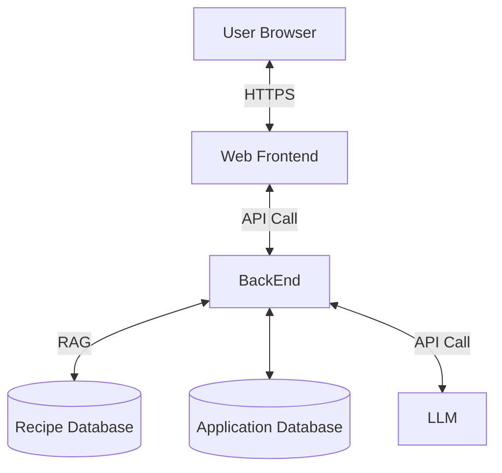

# System Architecture

### Considerations and future details: 

- Infrastructure/Platform Components
    - Authentication
    - Load balancer / Cloud hosting layer
    - Reverse Proxy / API Gateway

- Backend Components
    - Microservices
    - Background workers or queues (for async tasks)
    - Caching layer (Redis, Memcached)

- Observability & DevOps
    - Logging/monitoring stack (e.g., ELK, Prometheus)
    - CI/CD pipeline
